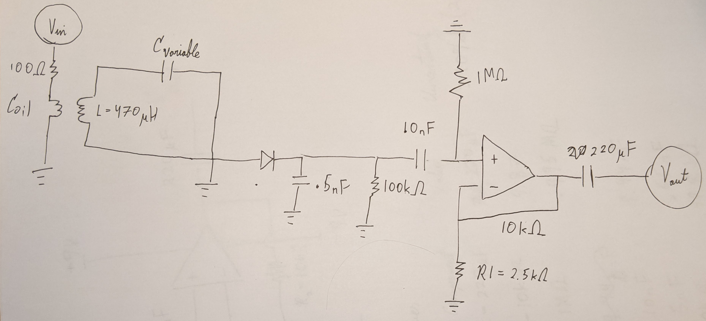

# AM-Radio
Making an AM radio using an Op-Amp and basic electronic components!
This was for a physics laboratory course on electronics. Using capacitors, resistors, inductors and an Op-Amp, I built a radio to receive signals. The full lab report I prepared can be read in "lab report.pdf", but here are some cool pictures:

The schematic of the circuit is shown below (pardon my bad drawing):

And a picture of the real thing is here:

